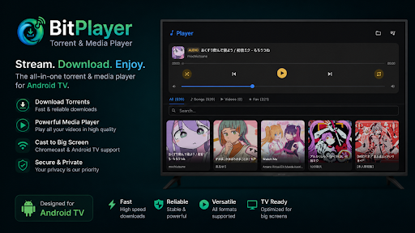
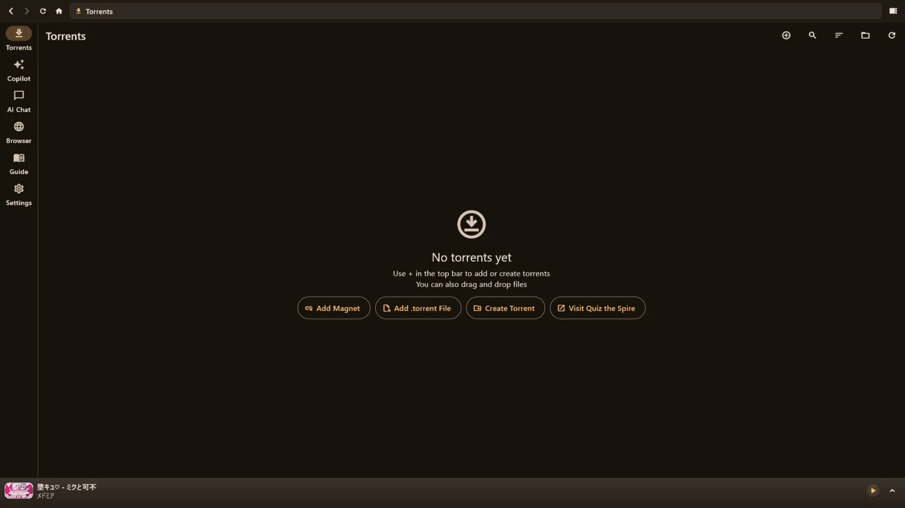

# Convert the Spire Reborn

## 📥 Quick Downloads

* **[Latest GitHub Release (v14.0.0)](https://github.com/Lukas-Bohez/ConvertTheSpireFlutter/releases/latest)**: Get the full-featured app for Windows, macOS, and Android (APK). The GitHub APK builds are ad-free and unlock all colours by default.
* **[Official Website (quizthespire.com)](https://quizthespire.com/)**: An additional place to download the app and learn more.
* **[Google Play Store (Convert The Spire Reborn)](https://play.google.com/store/apps/details?id=com.torrentspire.ai)**: The limited, App Store-compatible version featuring only the torrenting and media player functionality to comply with Play policies.

---

| | |
|---|---|
|  |  |

---

## What is this?

Hey everyone! If you remember the old web-based Convert the Spire downloader, you probably know that YouTube eventually blocked our server's IP. To keep the project alive and better than ever, I built **Convert the Spire Reborn**.

It is a fully native Flutter app that handles torrent management, media downloading, playlist importing, and playback right on your own device. It started out as a simple, ad-free tool to bulk-download massive playlists, but it has grown into a full media suite. You can now work with torrents and supported sources, cast to your TV, and easily manage your local library.

Because it runs natively on Windows, Android, and macOS, there is no heavy Electron bloat and no browser overhead. Android Play builds ship with YouTube conversion disabled to match Play policy, while APK builds keep the full downloader available.

## Repository Layout

The main code lives in `lib/`, platform configuration is under `android/`, `windows/`, `linux/`, `macos/`, `ios/`, and `web/`, and the reorganized documentation hub now lives in `docs/`.

Start here for docs:

* [Documentation index](docs/README.md)
* [Play AAB build guide](docs/build/play-store-aab.md)
* [Latest release notes](docs/releases/latest.md)

---

## Features

### The Core Stuff

* **Torrent Manager & Downloads:** Add torrents and supported sources, manage queues, and download directly in the app. Play Store builds disable the legacy YouTube conversion features; side-loaded APKs keep them enabled.
* **Massive Playlist Support:** The main reason this project exists! Paste a playlist link and bulk-download the whole thing, completely ad-free.
* **Multi-Site Engine:** It is not just YouTube anymore. Anything yt-dlp supports (over 1,800 sites) goes through the same seamless pipeline.
* **Built-in Media Player:** Play your audio and video directly in the app. It comes with playlists, queue management, and library tracking powered by `media_kit`.
* **File Converter:** Convert between 27+ formats, covering documents, images, archives, and media files.
* **DLNA & UPnP Casting:** Cast your downloaded media to any compatible smart TV or speaker on your local network.
* **Smart Browser:** The built-in browser handles URLs effortlessly. Bare domains, IP addresses, and plain search queries all work without manual formatting.

---

## Why Native?

If you are curious about the tech stack, the app is built to be fast, lightweight, and efficient:

* **Lightning Fast:** Flutter compiles directly to native code, meaning startup takes milliseconds compared to the heavy load times of Electron apps.
* **Low Memory:** It uses around 80 MB of memory instead of hoarding hundreds of megabytes like a Chromium process.
* **Network Power:** Raw UDP and TCP sockets allow for seamless DLNA casting and local device discovery, which web wrappers simply cannot do.
* **Battery Smart:** The native battery plugins let the app throttle intense background tasks if your device is running low on juice.

### Architecture Highlights

A concise overview of the main layers:

* **Flutter UI:** `HomeScreen` with ~13 named screens (Search, Player, Browser, etc.)
* **State Management:** `AppController` (ChangeNotifier) wired via `Provider`.
* **Core Services:** `YtDlpService`, `DownloadService`, `ConvertService`, `PlaylistService`, `DlnaDiscovery`, `CoordinatorService`, `ComputationService`.
* **Platform / Native:** `dart:io`, `media_kit`, `battery_plus`, native WebView bindings, raw sockets and isolates for background work.

---

## How to Get It

You can download the app directly from our site at [quizthespire.com](https://quizthespire.com/) or head over to the [GitHub Releases](https://github.com/Lukas-Bohez/ConvertTheSpireFlutter/releases) page for the pre-built binaries and Play-ready AABs. *(See the Quick Downloads section at the top of this page for direct links!)*

* **Windows:** Download the `.zip`, extract it, and run the `.exe`.
* **Android:** Grab the `.apk` for direct install, or upload the `.aab` to Google Play.
* **Android TV:** Uses the same Android build; UI is adaptive, but it is not separately certified for every TV model.
* **Linux:** No longer distributed as of v14.0.0 (the build could not be kept reliable). The source is still in the repo if you want to build it yourself.
* **macOS:** Download the macOS release package or build from source.

---

## Support & Funding

If you find this app useful, the easiest way to support development is a one-time donation or recurring sponsorship. You can donate via [Buy Me a Coffee](https://buymeacoffee.com/orokaconner) or become a GitHub Sponsor.

This app is open source, privacy-focused, and does not track what you download.

---

## Screenshots

Some screens from the v13.2.1 build:

## Contributing

I would love your help! Feel free to open an issue or submit a pull request.

1. Fork the repo.
2. Create your feature branch.
3. Make sure your code passes: `flutter analyse`.
4. Commit and open a PR!

## License & Support

This project is licensed under the GNU General Public License v3.0.

If this tool has saved you time and you want to support me:

* Buy me a coffee: [Oroka Conner](https://buymeacoffee.com/orokaconner)
* Website: [Convert the Spire](https://quizthespire.com/)
