# Convert the Spire Reborn

**Download whole playlists, see which songs you are missing, and play, convert, cast and share them, in one free app with nothing else to install.**

[](https://github.com/Lukas-Bohez/ConvertTheSpireFlutter/releases/latest)
[](https://github.com/Lukas-Bohez/ConvertTheSpireFlutter/releases)
[](LICENSE)

Windows · Android · Android TV · macOS · 18 languages · no installer · no account · no ads in the GitHub builds

## 📥 Install in a minute

One line or one file, then it runs. No admin rights, no Python, no account. Pick your platform:

| | Download | Then |
|---|---|---|
| **Windows** | Press <kbd>Win</kbd>+<kbd>R</kbd>, paste the line below and press Enter | It downloads the latest version, checks it and starts it. Run it again to update. |
| **Android phone or TV** | `ConvertTheSpireReborn.apk` from the [latest release](https://github.com/Lukas-Bohez/ConvertTheSpireFlutter/releases/latest) | Open the file and allow the install when Android asks. |
| **macOS** | `ConvertTheSpireReborn-macOS.zip` from the [latest release](https://github.com/Lukas-Bohez/ConvertTheSpireFlutter/releases/latest) | Unzip and open the app. If macOS says it cannot check the developer, right-click it and choose **Open**. |
| **Google Play** | [The Play Store version](https://play.google.com/store/apps/details?id=com.torrentspire.ai) | Everything except the YouTube download features, which Play policy does not allow. |

```powershell
powershell -c "irm https://raw.githubusercontent.com/Lukas-Bohez/ConvertTheSpireFlutter/main/install.ps1 | iex"
```

The line runs [install.ps1](install.ps1) from this repository: it installs to `%LOCALAPPDATA%\Programs\ConvertTheSpireReborn` for your account only, checks the download against the release's `SHA256SUMS.txt`, and adds the app to the Start menu. No blue "Windows protected your PC" screen. Rather have the zip? Take `ConvertTheSpireReborn-windows-x64.zip` from the [latest release](https://github.com/Lukas-Bohez/ConvertTheSpireFlutter/releases/latest), extract it and double-click `convert_the_spire_reborn.exe`.

Also on the official site: [quizthespire.com](https://quizthespire.com/).

---

## Why installing it is the easy part

Most tools that download from YouTube and other sites expect you to do some assembly first: install Python, put FFmpeg on your PATH, learn command-line flags, or keep a browser tab of a converter site open, one song at a time. This app skips all of that.

| Getting set up | The usual way | Convert the Spire Reborn |
|---|---|---|
| The downloader | Install Python, then `pip install yt-dlp` | Built into the Android app. On Windows and macOS the app fetches a self-contained yt-dlp on first start and keeps it up to date |
| The converter | Download FFmpeg and add it to your PATH | Built into the Android app, fetched by itself on Windows |
| Installing on Windows | Run an installer with administrator rights | Paste one line, or extract the zip and double-click |
| Your first playlist | Learn command-line flags, or a converter site one song at a time | Paste the link and press download |
| Removing it | Run an uninstaller | Delete the folder |

* **One download, then it just runs.** On Windows there is no installer, no administrator rights and nothing to configure. On first start the app fetches [yt-dlp](https://github.com/yt-dlp/yt-dlp) and FFmpeg by itself and keeps yt-dlp up to date in the background, so sites that change their pages keep working.
* **Nothing extra on Android.** FFmpeg is built into the APK. No root, no Termux, no Google account, no separate player. The same APK runs on phones, tablets and Android TV.
* **Nothing to uninstall on Windows.** The app is the `.exe`, a `data` folder and a `dll` folder, in `%LOCALAPPDATA%\Programs\ConvertTheSpireReborn` or wherever you extract the zip. It adds itself to "Open with" for your songs, videos, torrents and magnet links, for your Windows account only and without admin rights. To remove the app, delete the folder.
* **Updates tell you what changed.** After an update the app shows what is new, including anything from releases you skipped.
* **Native, not a web page in a box.** It is written in Flutter and compiled for each platform, so it starts quickly and stays light on memory next to Electron apps.

> **macOS note:** yt-dlp installs itself on a Mac too. Converting to MP3 and M4A needs FFmpeg, which you add once with `brew install ffmpeg`.

## Why it replaces a whole folder of apps

Downloading is only the first step. Usually you then need something to check what you already have, a player, a converter, a way to get it onto the TV, and a browser that does not drown you in ads. Here it is all one app:

| You want to… | The usual way | In Convert the Spire |
|---|---|---|
| Grab a 1,000-song playlist | A command-line tool and a script, or a converter site one song at a time | Paste the link. Large playlists load in full, on phones too. |
| Know which songs you are still missing | Compare file names by hand | **Compare** lists what is in your folder, what is missing and what does not belong, then downloads only the missing songs. |
| Keep a playlist up to date | Redo it every time the playlist grows | **Watched playlists** check for new songs and fetch them. |
| Download while watching | Copy the link into another program | Press download in the built-in browser. Playing from a playlist? It asks whether you want the song or the whole playlist. |
| Play your music and videos | A separate player app | Built-in player with queue, shuffle, favourites, statistics and volume leveling. |
| Convert files | An upload-and-wait website | 27+ formats (audio, video, images, documents, archives), offline. |
| Watch together | A service that needs everyone to sign up | Share a six-character code. Runs on your own Wi-Fi, no server, no account. |
| Get it on the TV | Another casting app | DLNA/UPnP casting, and an Android TV version you can use with the remote. |
| Browse without ads | A browser plus an ad-blocking extension | Built-in browser with ad and tracker blocking, userscripts, and on Windows real Chrome and Firefox extensions. |
| Torrents | A separate torrent client | Built in, with its own queue and settings. |

It works with YouTube and with every site yt-dlp supports, more than 1,800 of them, through the same pipeline.

---

## ▶ Watch the demo

[](https://youtu.be/66Rx8PDY_r0)

*A quick tour of the app: [watch on YouTube](https://youtu.be/66Rx8PDY_r0).*

---

## What is this?

Hey everyone! If you remember the old web-based Convert the Spire downloader, you probably know that YouTube eventually blocked our server's IP. To keep the project alive and better than ever, I built **Convert the Spire Reborn**.

It is a fully native Flutter app that handles media downloading, playlist importing, torrents and playback right on your own device. It started out as a simple, ad-free tool to bulk-download massive playlists, and it has grown into a full media suite. Because everything runs on your device, there is no server in the middle to get blocked, and nothing you download passes through anyone else.

## Features

### Downloading

* **Whole playlists**, including very large ones, on desktop and on phones.
* **Compare with a folder:** see Matched, Missing and Extras (half-finished downloads, files in the wrong format, songs that are not in the playlist), fix the extras in one tap, and download only what is missing, straight into that folder. Export the missing list or an M3U playlist.
* **Watched playlists** that download new additions automatically.
* **MP3, M4A and MP4**, with quality and bitrate settings, SponsorBlock, and per-format download folders.
* **1,800+ sites** through yt-dlp, not only YouTube.
* **Keeps going with the screen off** on Android, with progress in the notification.

### Playing

* **Media player** for audio and video: queue, shuffle, repeat, favourites, sorting and filters, play statistics.
* **Remembers your library** and reopens it on the next start.
* **Copy a song's title** with a long press or a right click, or from the track menu, to paste it into a search or a message.
* **Volume leveling** so every track plays at the same loudness.
* **Fix metadata** and **organize media** tools for messy folders.
* **Watch Together** across phone, PC, Mac and TV. A guest without the file streams it from the host.
* **DLNA/UPnP casting** to smart TVs and speakers.

### Browsing

* **Built-in browser** with ad and tracker blocking, tabs, incognito, history and favourites.
* **Userscripts** (Tampermonkey/Greasemonkey compatible) on every platform, with one-tap searches for popular ones such as dark mode, Return YouTube Dislike and SponsorBlock.
* **Browser extensions on Windows:** Chrome extensions and add-ons from addons.mozilla.org, with a catalog, permission prompts, popups and options pages. Tested with uBlock Origin Lite and Dark Reader.

### Everything else

* **File converter** for 27+ formats.
* **Torrents** with a full settings page.
* **18 languages on every screen**, following your device or chosen in Settings: Arabic, Dutch, English, French, German, Hindi, Indonesian, Italian, Japanese, Korean, Polish, Portuguese, Russian, Simplified Chinese, Spanish, Turkish, Ukrainian, Vietnamese. Translations live in [`lib/l10n/`](lib/l10n/) and PRs are welcome.
* **Report a bug** from Settings opens a GitHub issue with the app version, platform and recent log filled in. You see all of it before anything is sent.

## On phones and TVs

The Android app is the full app, not a cut-down companion: downloads, Compare, the player, the file converter, Watch Together, casting, torrents and the browser all work there. Some things differ because of Android itself:

* **Folders:** pick a download folder once in Settings and the app keeps it. Without one, downloads go to your phone's Downloads folder, where every music player can find them.
* **Extensions:** Chrome and Firefox extensions need a desktop browser engine, which Android's web view does not have. In the browser menu, **Extensions** shows what runs on the phone instead: the built-in ad blocker and userscripts, which cover what most people install extensions for.
* **Android TV:** the same APK, laid out for a TV and its remote, with a file browser made for the D-pad.

## Privacy

No account, no sign-up, and the app does not track what you download. The GitHub builds have no ads and no advertising ID. The Play Store build shows ads, and its [data safety details](docs/publishing/play-data-safety.md) say exactly what that involves.

## Screenshots

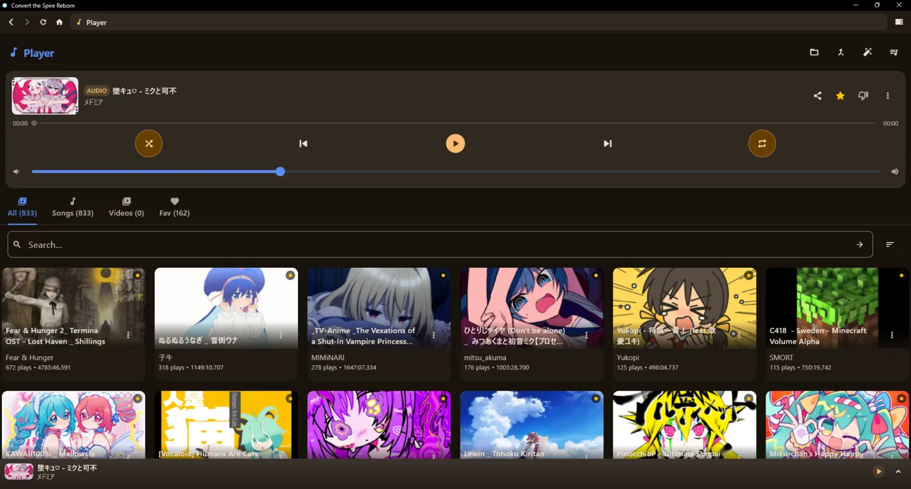
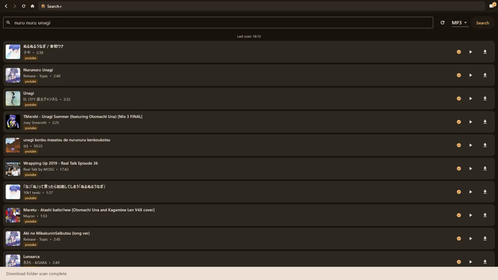
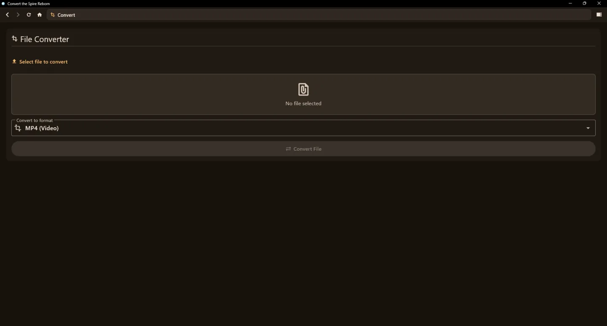
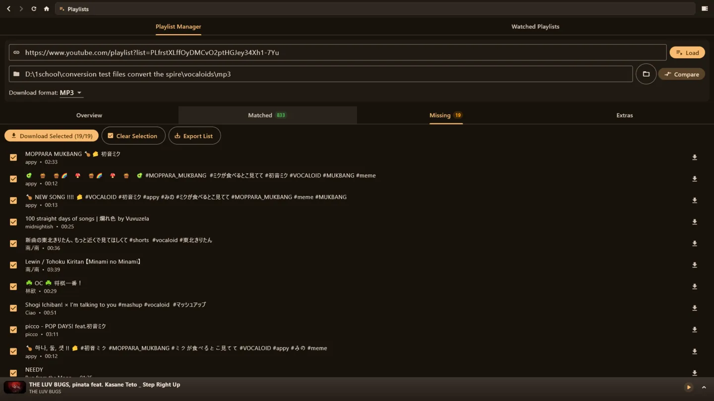
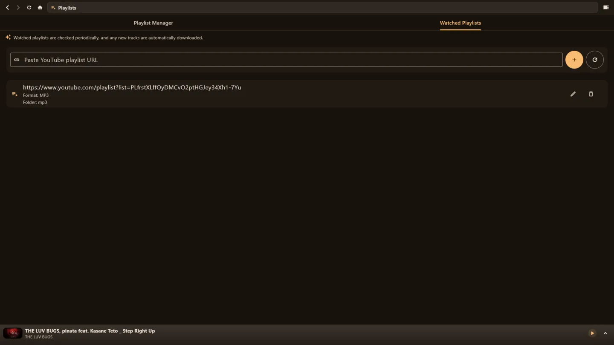
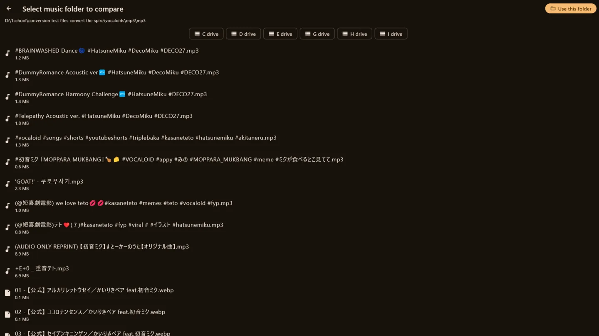
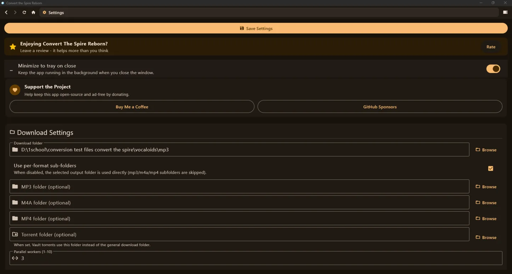
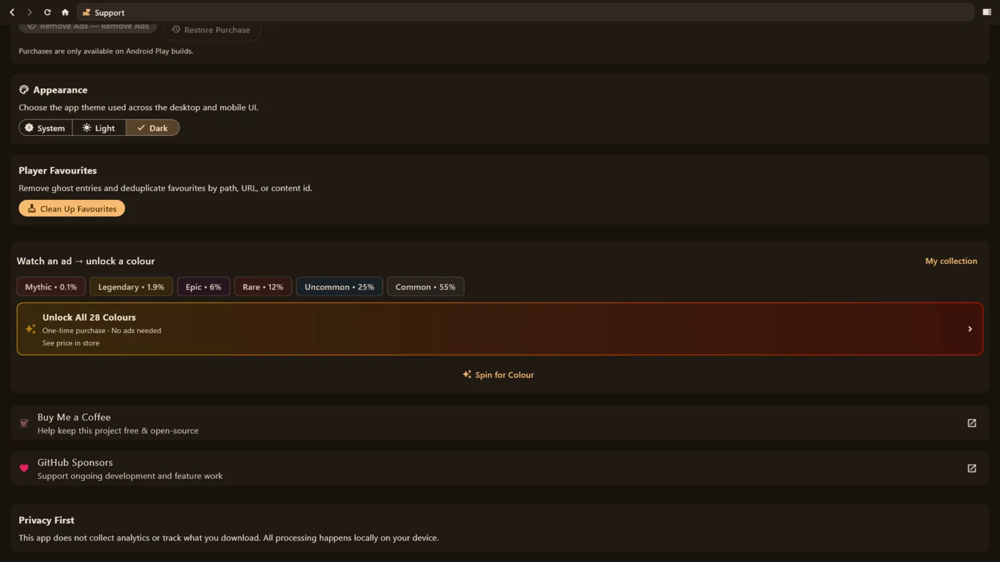
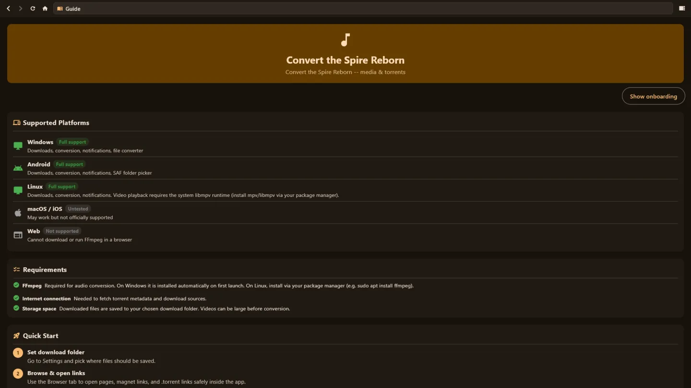
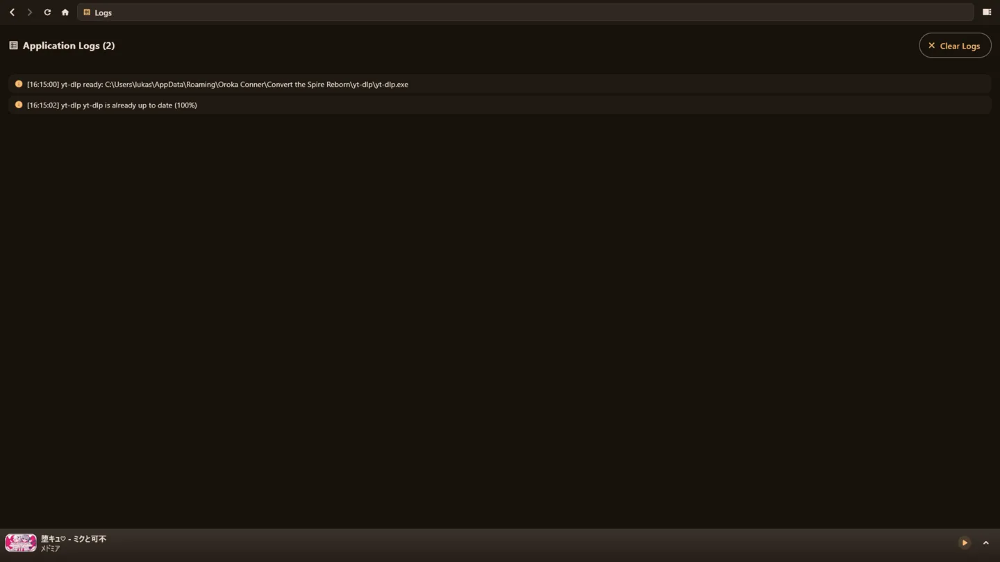
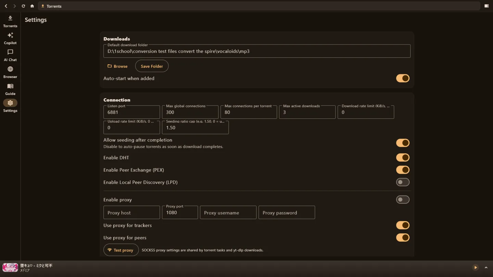

## Questions

**Windows shows a blue "Windows protected your PC" screen.** That screen is SmartScreen checking a program your browser downloaded that is not signed with a paid certificate. Install with the [one line above](#-install-in-a-minute) instead and it does not appear; to update, run the same line again. With the zip, choose **More info**, then **Run anyway**, and when updating, extract into a new folder rather than over the old one.

**Android says the app is from an unknown source.** Android asks this for any app that does not come from the Play Store. Allow it for the app you opened the APK from (your browser or file manager).

**Why does the Play Store version have no YouTube downloads?** Google Play does not allow them. The APK and desktop builds here have everything.

**Where do my downloads go?** Wherever you set in Settings. On a phone with nothing set, into `Download/mp3`, `Download/m4a` or `Download/mp4`.

**Something broke.** Use **Report a bug** in Settings, or [open an issue](https://github.com/Lukas-Bohez/ConvertTheSpireFlutter/issues).

## For developers

The main code lives in `lib/`; platform configuration is under `android/`, `windows/`, `macos/`, `linux/`, `ios/` and `web/`; documentation is in [`docs/`](docs/README.md). Start with the [documentation index](docs/README.md), [how a release goes out](docs/releases/how-to-release.md), the [Play AAB build guide](docs/build/play-store-aab.md) and the [latest release notes](docs/releases/latest.md).

* **UI:** Flutter, with `HomeScreen` hosting the main screens (Home, Multi-Search, Player, Browser, Playlists, Torrents and more).
* **State:** `AppController` (a `ChangeNotifier`) wired through `Provider`.
* **Services:** `YtDlpService`, `DownloadService`, `ConvertService`, `PlaylistService`, `DlnaDiscovery`, `WatchPartyService` and friends.
* **Platform:** `dart:io`, `media_kit`, native WebView bindings (WebView2 on Windows), raw sockets for DLNA and Watch Together, and isolates for background work.

Linux builds are no longer distributed (since v14.3.1 the build could not be kept reliable), but the source is here if you want to build it yourself.

### Contributing

I would love your help! Open an issue or a pull request.

1. Fork the repo and create a feature branch.
2. Make sure `flutter analyze` and `flutter test` pass.
3. Open a PR.

## Support & license

This project is licensed under the GNU General Public License v3.0.

If this app has saved you time, the easiest way to support it is a one-time donation or a sponsorship:

* Buy me a coffee: [Oroka Conner](https://buymeacoffee.com/orokaconner)
* Become a GitHub Sponsor
* Website: [Convert the Spire](https://quizthespire.com/)
